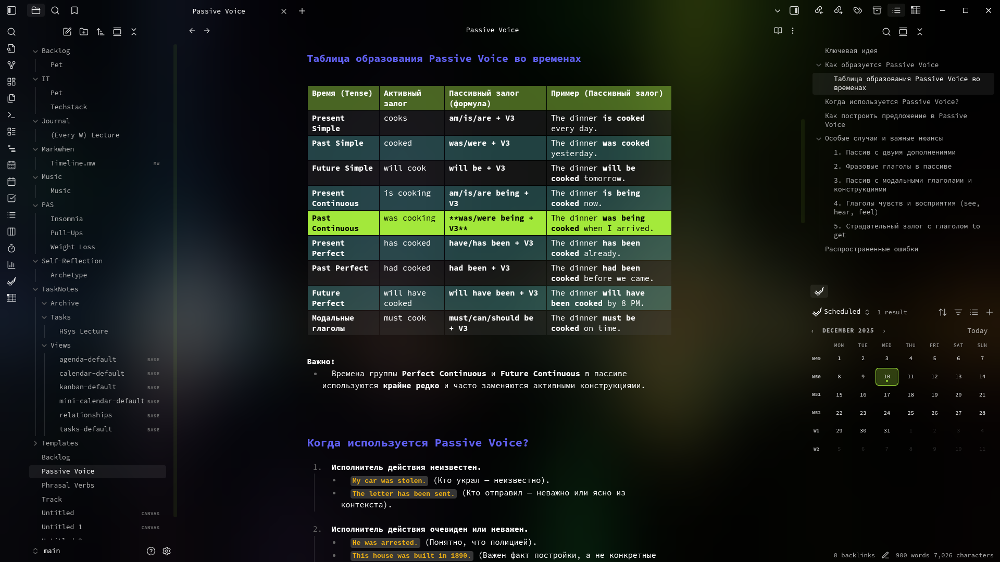
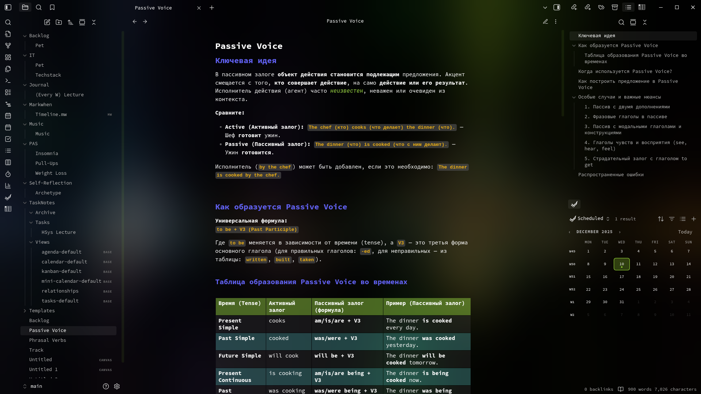
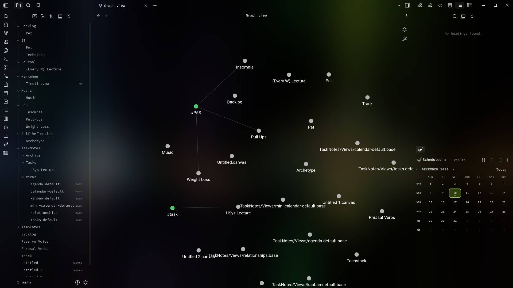

# Exotic Theme for Obsidian

A unique and visually striking theme for [Obsidian](https://obsidian.md/) that brings an exotic atmosphere to your note-taking experience. Designed with attention to detail and aesthetics, this theme enhances readability and visual appeal while maintaining focus on your thoughts.

## ✨ Features

- **Monospace Font**: Uses "Source Code Pro" for both editor and preview modes for a consistent coding-like feel.
- **Custom Colors**: Carefully chosen color palette for headers, inline code, and emphasis.
- **Enhanced Tables**: Styled table headers and alternating row colors for better readability.
- **Hover Effects**: Subtle brightness changes on lines and interactive elements for better feedback.
- **Dark & Light Modes**: Optimized for both dark and light environments.

## 🖼️ Screenshots

*Editor mode with syntax highlighting*

*Preview mode showcasing typography and styling*

*Graph view with custom node fonts*

## 🛠️ Installation

### Manual Installation

1. Download the latest release from the [Releases](https://github.com/jzcurious/obsidian-theme-exotic-original.git) page.
2. Extract the files into your vault’s themes folder: `<vault>/.obsidian/themes/Exotic/`
3. Open Obsidian Settings → Appearance → Themes.
4. Select “Exotic” from the dropdown menu.
5. Reload Obsidian or restart if prompted.

## 🎨 Customization

This theme uses CSS variables defined in the `:root` section. You can easily customize colors, fonts, and sizes by editing the `theme.css` file. Look for variables like:

- `--default-font`: Main font family
- `--color-header`: Header text color
- `--color-italic`: Emphasis (italic) color
- `--color-inline-code`: Inline code color
- `--color-table-odd-bg`: Odd table row background

## 🧩 Compatibility

- Works best with Obsidian v1.0+
- Compatible with most core plugins
- May require adjustments with heavy UI customization plugins

## 🤝 Contributing

Feel free to open issues for bugs or suggestions. Pull requests are welcome!

## 📜 License

MIT License. See [LICENSE](./LICENSE) for more details.

## 👨‍💻 Author

**jzcurious**
[GitHub Profile](https://github.com/jzcurious)
